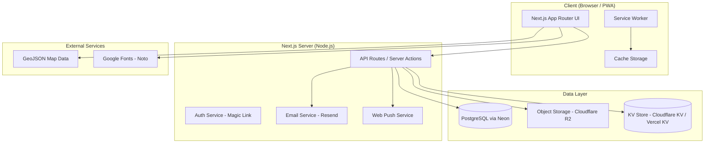
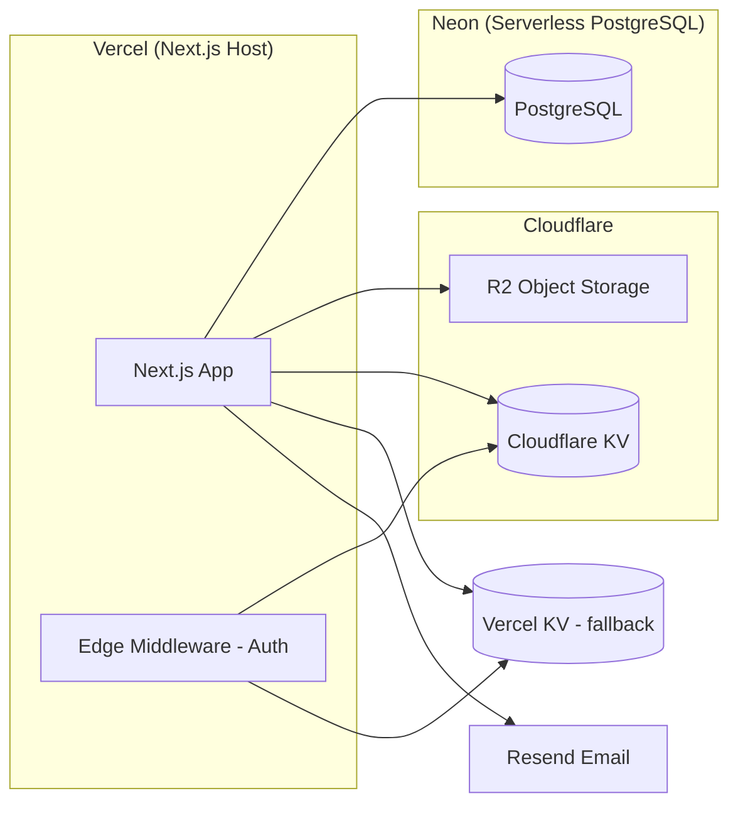
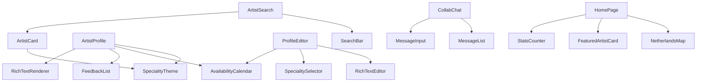
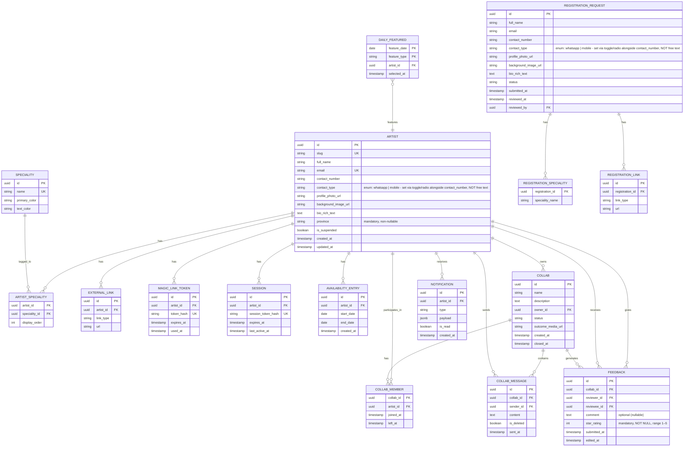

# Design Document: Carnatic Artist Portal

## Overview

The Carnatic Artist Portal is a mobile-first Progressive Web App (PWA) for Carnatic musicians based in The Netherlands. It serves two primary audiences: **Visitors** (unauthenticated browsers) and **Artists** (approved, authenticated musicians). A third role, **Admin**, manages approvals and moderation.

### Core Capabilities

| Capability | Audience |
|---|---|
| Browse artist profiles & directory | Public |
| Submit registration request | Public |
| Manage own profile & availability | Artist |
| Structured artist search | Artist |
| Create & participate in Collabs (group chat) | Artist |
| Leave feedback after collaborations | Artist |
| Approve/reject registrations, moderate content | Admin |

### Key Design Goals

- **Mobile-first PWA** - installable, offline-capable, Lighthouse PWA ≥ 90
- **Speciality-based visual theming** - colour-coded profiles per instrument
- **Magic-link authentication** - no passwords, email-only login
- **Multi-region extensibility** - all deployment-specific values in config/env
- **Full Unicode / Indic script support** - Tamil, Kannada, Telugu, Malayalam, Devanagari, etc.

---

## Architecture

### High-Level Architecture



### Technology Stack

| Layer | Technology | Rationale |
|---|---|---|
| Framework | **Next.js 14 (App Router)** | SSR/SSG for SEO & performance, API routes, server actions, PWA-friendly |
| Language | **TypeScript** | Type safety across full stack |
| Styling | **Tailwind CSS** | Utility-first, easy dynamic theming via CSS variables |
| Database | **PostgreSQL (Neon)** | Serverless PostgreSQL, git-like branching for preview envs, no connection exhaustion on serverless, official Vercel Postgres backend |
| ORM | **Prisma** | Type-safe DB access, migrations; uses `@neondatabase/serverless` driver for edge-compatible connections |
| Auth | **Custom magic-link** (JWT + Resend) | No passwords; email-only per requirements |
| File Storage | **Cloudflare R2** | S3-compatible object storage, zero egress fees, works on both Vercel and Cloudflare deployments; accessed via `@aws-sdk/client-s3` with R2 endpoint |
| Email | **Resend** | Transactional email (login links, notifications) |
| Push Notifications | **Web Push (VAPID)** | PWA push for Collab invites, feedback notifications |
| Rich Text | **Tiptap** | ProseMirror-based, Unicode-safe, extensible |
| Maps | **D3.js + GeoJSON** | Configurable map rendering, no external map API dependency |
| i18n | **next-intl** | File-based translation JSON, locale switching, date/number formatting |
| Testing | **Vitest + fast-check** | Unit, property-based testing |
| E2E Testing | **Playwright** | Browser automation |

### Deployment Architecture



### Multi-Region Configuration

All deployment-specific values are read from environment variables and a `deployment.config.json` file (never hard-coded):

```
DEPLOYMENT_REGION=NL
DEPLOYMENT_NAME="Carnatic Artist Portal"
DEPLOYMENT_LOCALE_PRIMARY=en
DEPLOYMENT_LOCALE_SECONDARY=nl
DEPLOYMENT_MAP_GEOJSON_URL=/geo/netherlands-provinces.geojson
DEPLOYMENT_BRANDING_LOGO_URL=/assets/logo.svg
```

---

## Components and Interfaces

### Page / Route Structure

```
app/
├── (public)/
│   ├── page.tsx                  # Home page
│   ├── artists/
│   │   ├── page.tsx              # Artist directory
│   │   └── [slug]/page.tsx       # Artist profile
│   ├── register/page.tsx         # Registration form
│   └── auth/
│       ├── login/page.tsx        # Request login link
│       └── verify/page.tsx       # Magic link verification
├── (artist)/                     # Auth-protected
│   ├── dashboard/page.tsx        # Artist dashboard
│   ├── profile/
│   │   ├── edit/page.tsx         # Profile management
│   │   └── availability/page.tsx # Availability calendar
│   ├── search/page.tsx           # Artist search
│   └── collabs/
│       ├── page.tsx              # Collab list
│       ├── new/page.tsx          # Create collab
│       └── [id]/page.tsx         # Collab chat
└── (admin)/                      # Admin-protected
    ├── dashboard/page.tsx
    ├── registrations/
    │   ├── page.tsx              # Pending list
    │   └── [id]/page.tsx         # Review request
    └── collabs/
        ├── page.tsx              # Moderation view
        └── [id]/page.tsx         # Message history
```

### Key UI Components



### Structured Artist Search Service Interface

```typescript
interface ArtistSearchParams {
  nameQuery?: string;        // free-text, matched against artist full_name (case-insensitive, partial match)
  speciality?: string;       // exact Speciality name from the dropdown
  availableFrom?: Date;      // optional start of desired collab window
  availableTo?: Date;        // optional end of desired collab window
}

interface ArtistSearchResult {
  artists: ArtistSummary[];
  totalCount: number;
}

// Returns all distinct Speciality names from approved artists, sorted alphabetically
async function getSearchableSpecialities(): Promise<string[]>

// Executes server-side DB query - no external API calls
async function searchArtists(params: ArtistSearchParams): Promise<ArtistSearchResult>
```

### Authentication Service Interface

```typescript
interface MagicLinkRequest {
  email: string;
}

interface MagicLinkToken {
  token: string;           // cryptographically random, stored hashed
  artistId: string;
  expiresAt: Date;         // now + 72 hours
  usedAt?: Date;
}

interface Session {
  sessionId: string;
  artistId: string;
  role: 'artist' | 'admin';
  expiresAt: Date;         // now + 30 days
}

async function issueMagicLink(email: string): Promise<void>
async function verifyMagicLink(token: string): Promise<Session>
async function invalidatePriorTokens(artistId: string): Promise<void>
```

### Speciality Theming Service Interface

```typescript
interface SpecialityTheme {
  speciality: string;
  primaryColor: string;    // hex
  textColor: string;       // hex, contrast-safe (≥4.5:1)
}

function getThemeForSpecialities(specialities: string[]): {
  background: string;      // CSS gradient or solid color
  textColor: string;
  accentColor: string;
}
```

---

## Data Models

### Entity Relationship Diagram



### Prisma Schema (abbreviated)

> **Neon serverless driver**: Configure Prisma with `@neondatabase/serverless` as the connection adapter for edge-compatible, pooled connections. Set `DATABASE_URL` to the Neon connection string (pooled endpoint for serverless functions, direct endpoint for migrations).

```prisma
model Artist {
  id                String              @id @default(uuid())
  slug              String              @unique
  fullName          String
  email             String              @unique
  contactNumber     String
  contactType       String              // enum: "whatsapp" | "mobile" - selected via toggle/radio alongside contactNumber, NOT free text
  profilePhotoUrl   String
  backgroundImageUrl String?
  bioRichText       String?             // Tiptap JSON stored as text
  province          String              // mandatory, non-nullable
  isSuspended       Boolean             @default(false)
  createdAt         DateTime            @default(now())
  updatedAt         DateTime            @updatedAt

  specialities      ArtistSpeciality[]
  externalLinks     ExternalLink[]
  availabilityEntries AvailabilityEntry[]
  ownedCollabs      Collab[]            @relation("CollabOwner")
  collabMemberships CollabMember[]
  sentMessages      CollabMessage[]
  givenFeedback     Feedback[]          @relation("Reviewer")
  receivedFeedback  Feedback[]          @relation("Reviewee")
  notifications     Notification[]
  magicLinkTokens   MagicLinkToken[]
  sessions          Session[]
  dailyFeatures     DailyFeatured[]
}

model Speciality {
  id           String             @id @default(uuid())
  name         String             @unique
  primaryColor String             // hex e.g. "#E85D04"
  textColor    String             // contrast-safe hex
  artists      ArtistSpeciality[]
}

// ARTIST_SPECIALITY constraint note:
// Each Artist MUST have between 1 and 3 Speciality associations.
// This is enforced at the application layer (not a DB-level constraint).
// The UX provides an "Add Speciality" control that is hidden/disabled once 3 specialities are selected.
// Attempting to save a profile with 0 specialities is rejected with a validation error.

model Feedback {
  id          String    @id @default(uuid())
  collabId    String
  reviewerId  String
  revieweeId  String
  starRating  Int       // mandatory, NOT NULL, range 1–5
  comment     String?   // optional (nullable)
  submittedAt DateTime  @default(now())
  editedAt    DateTime?
}

model Collab {
  id              String         @id @default(uuid())
  name            String
  description     String?
  ownerId         String
  owner           Artist         @relation("CollabOwner", fields: [ownerId], references: [id])
  status          String         @default("active") // "active" | "completed" | "completed_other" | "incomplete"
  outcomeMediaUrl String?
  createdAt       DateTime       @default(now())
  closedAt        DateTime?
  members         CollabMember[]
  messages        CollabMessage[]
  feedback        Feedback[]
}

model DailyFeatured {
  featureDate  DateTime  @db.Date
  featureType  String    // "instrumentalist" | "singer"
  artistId     String
  artist       Artist    @relation(fields: [artistId], references: [id])
  selectedAt   DateTime  @default(now())

  @@id([featureDate, featureType])
}
```

### Deployment Configuration Schema

```typescript
// deployment.config.ts (loaded at startup, never hard-coded)
interface DeploymentConfig {
  region: string;                  // e.g. "NL"
  name: string;                    // Portal display name
  locales: {
    primary: string;               // e.g. "en"
    supported: string[];           // e.g. ["en", "nl"]
  };
  mapGeoJsonUrl: string;           // path or URL to GeoJSON
  branding: {
    logoUrl: string;
    colorOverrides?: Record<string, string>;
  };
}
```

---

## Correctness Properties

*A property is a characteristic or behavior that should hold true across all valid executions of a system - essentially, a formal statement about what the system should do. Properties serve as the bridge between human-readable specifications and machine-verifiable correctness guarantees.*

### Property 1: Registration mandatory-field validation

*For any* registration form submission where one or more mandatory fields (full name, email, contact number, contact type, profile photo, at least one Speciality - maximum three) are absent or invalid, the Portal SHALL reject the submission and return field-level validation errors without persisting any data.

**Validates: Requirements 1.2, 1.7**

### Property 2: Registration data round-trip

*For any* valid registration form submission, the data stored in the Portal SHALL be retrievable and SHALL contain exactly the values that were submitted, with no field loss or corruption.

**Validates: Requirements 1.6, 1.8**

### Property 3: Admin notification on registration

*For any* successfully submitted registration request, every Admin account in the system SHALL have a corresponding notification record referencing that registration request.

**Validates: Requirements 1.9**

### Property 4: Approval creates artist and token

*For any* pending Registration Request that an Admin approves, the Portal SHALL create exactly one Artist account with the submitted details and exactly one valid (non-expired, non-used) Magic Link Token for that Artist.

**Validates: Requirements 2.3**

### Property 5: Rejection does not create artist

*For any* pending Registration Request that an Admin rejects, the Portal SHALL set the request status to "rejected" and SHALL NOT create an Artist account.

**Validates: Requirements 2.4**

### Property 6: Magic link token expiry invariant

*For any* Magic Link Token issued by the Portal, the token's `expiresAt` timestamp SHALL equal the `issuedAt` timestamp plus exactly 72 hours.

**Validates: Requirements 2.5**

### Property 7: Registration request filter correctness

*For any* filter applied to the Registration Request list (by status, by date range, or both), every result returned SHALL satisfy all applied filter criteria, and no result satisfying all criteria SHALL be omitted.

**Validates: Requirements 2.8**

### Property 8: Profile update round-trip

*For any* authenticated Artist who saves a valid profile update (including Speciality changes, bio, photos, or external links), the updated values SHALL be immediately retrievable from both the authenticated profile management interface and the public Profile page.

**Validates: Requirements 3.2, 3.3, 3.4, 3.5, 3.6, 3.8**

### Property 9: Profile mandatory-field validation on save

*For any* profile save attempt where a mandatory field (full name, email, contact number, contact type, profile photo, province, or at least one Speciality) has been cleared, the Portal SHALL reject the save and return a field-level validation error without persisting any changes. *For any* profile save attempt that would result in more than three Specialities being associated with the Artist, the Portal SHALL reject the save with a validation error.

**Validates: Requirements 3.7**

### Property 10: Speciality colour theme correctness

*For any* Artist with a single Speciality, the theme applied to their Profile page and profile card SHALL use that Speciality's configured primary colour as the dominant background. *For any* Artist with multiple Specialities, the applied gradient SHALL reference the primary colour of every listed Speciality.

**Validates: Requirements 4.5, 4.6, 5.2, 5.3, 5.4**

### Property 11: Speciality colour contrast invariant

*For any* Speciality in the Portal's colour palette, the contrast ratio between the Speciality's assigned `textColor` and its `primaryColor` SHALL be at least 4.5:1 as computed by the WCAG relative luminance formula.

**Validates: Requirements 5.5**

### Property 12: Availability calendar round-trip

*For any* availability entry (date range) that an authenticated Artist adds to their Availability Calendar, that entry SHALL appear on the Artist's public Profile page. *For any* availability entry that the Artist subsequently removes, that entry SHALL no longer appear on the public Profile page.

**Validates: Requirements 6.2, 6.3, 6.5**

### Property 13: Search speciality typeahead completeness

*For any* set of approved Artists in the database, the Speciality options returned by `getSearchableSpecialities()` SHALL contain exactly the set of distinct Speciality names that appear on at least one approved Artist's profile - no more, no less.

**Validates: Requirements 7.4, 7.5**

### Property 14: Structured search result correctness

*For any* combination of search parameters (nameQuery, speciality, availableFrom, availableTo), every Artist returned in the results SHALL satisfy ALL provided criteria: name contains nameQuery (if provided), has the selected Speciality (if provided), and has at least one Availability Calendar entry overlapping [availableFrom, availableTo] (if dates provided). No Artist satisfying all provided criteria SHALL be omitted from the results.

**Validates: Requirements 7.7, 7.8, 7.11**

### Property 15: Collab creation and membership round-trip

*For any* Collab created by an authenticated Artist, the Collab SHALL be retrievable with the correct name, description, and owner. *For any* Artist added to or removed from a Collab, the Collab's member list SHALL reflect that change immediately, and the affected Artist SHALL receive a notification upon being added.

**Validates: Requirements 8.1, 8.2, 8.3, 8.4, 8.8, 8.9**

### Property 16: Closed collab rejects new messages

*For any* Collab that has been closed (with any status: Completed, Completed via Other Channels, or Incomplete), any attempt by any member to send a new message to that Collab SHALL be rejected.

**Validates: Requirements 9.3**

### Property 17: Feedback prompt conditioned on close status

*For any* Collab closed with status Completed or Completed via Other Channels, every Collab member SHALL receive a feedback prompt notification. *For any* Collab closed with status Incomplete, no Collab member SHALL receive a feedback prompt notification.

**Validates: Requirements 9.4, 9.5**

### Property 18: Feedback uniqueness per (reviewer, reviewee, collab)

*For any* (reviewer Artist, reviewee Artist, Collab) triple, the Portal SHALL accept exactly one Feedback submission. Any subsequent submission for the same triple SHALL be rejected with an informational message.

**Validates: Requirements 11.5, 11.6**

### Property 19: Feedback editability window

*For any* submitted Feedback, an edit attempt made within 7 days of the original submission SHALL succeed. An edit attempt made more than 7 days after the original submission SHALL be rejected.

**Validates: Requirements 11.7**

### Property 20: Magic link invalidation on re-issue

*For any* Artist who requests a new Login Link while one or more previously issued, unused Login Link Tokens exist for that Artist, all prior unused tokens SHALL be invalidated before the new token is issued.

**Validates: Requirements 12.2**

### Property 21: Session expiry invariant

*For any* authenticated session created by the Portal, the session's `expiresAt` timestamp SHALL equal the session creation timestamp plus exactly 30 days.

**Validates: Requirements 12.3**

### Property 22: Home page artist counts accuracy

*For any* state of the Portal's artist database, the total approved Artist count displayed on the home page SHALL equal the actual count of Artist records with approved status, and the actively-seeking-collaboration count SHALL equal the count of approved Artists who have at least one future-dated Availability Calendar entry.

**Validates: Requirements 15.2, 15.3, 15.4, 15.5**

### Property 23: Home page province map accuracy

*For any* set of Artists with province data, the count displayed for each province on the Netherlands map SHALL equal the number of approved Artists whose `province` field matches that province.

**Validates: Requirements 15.6, 15.7, 15.8**

### Property 24: Daily featured artist consistency and rotation

*For any* given calendar date, all requests for the "Instrumentalist of the Day" or "Singer of the Day" SHALL return the same Artist. When more than one eligible Artist exists, the Artist selected for a given date SHALL differ from the Artist selected for the immediately preceding date.

**Validates: Requirements 15.9, 15.11, 15.12, 15.14, 15.15, 15.18**

### Property 25: Translation key completeness

*For any* translation key present in the primary locale file (English), a corresponding translation key SHALL exist in every other locale file listed in the deployment configuration.

**Validates: Requirements 17.2**

### Property 26: Locale date and number formatting

*For any* date, time, or number value rendered by the Portal, the formatted output SHALL conform to the conventions of the currently active locale (e.g., DD-MM-YYYY and comma decimal separator for the NL locale).

**Validates: Requirements 17.6**

### Property 27: Unicode Indic script round-trip

*For any* Unicode string containing characters from any Indic script (Tamil, Kannada, Telugu, Malayalam, Devanagari, or any other Unicode-encoded script) stored in any user-generated content field (biographical write-up, Collab message, Feedback comment), the string retrieved from the Portal SHALL have identical Unicode code points to the string that was submitted, with no character loss, substitution, or corruption.

**Validates: Requirements 18.1, 18.3, 18.9**

### Property 28: Feedback star rating mandatory, comment optional

*For any* Feedback submission that omits the `star_rating` field or provides a value outside the range 1–5, the Portal SHALL reject the submission with a validation error. *For any* Feedback submission that omits the `comment` field, the Portal SHALL accept the submission provided `star_rating` is a valid integer in the range 1–5.

**Validates: Requirements 11.1, 11.2**

---

## Error Handling

### Authentication Errors

| Scenario | Behaviour |
|---|---|
| Expired magic link token | Return 401 with `LINK_EXPIRED` code; UI shows expiry message and "Request new link" CTA |
| Already-used magic link token | Return 401 with `LINK_USED` code; UI shows same expiry message |
| Invalid / tampered token | Return 401 with `LINK_INVALID` code |
| Expired session | Clear session cookie; redirect to `/auth/login` |
| Suspended artist attempts action | Return 403 with `ACCOUNT_SUSPENDED` code; UI shows suspension notice |

### Validation Errors

All API endpoints return `400` with a structured error body:

```json
{
  "error": "VALIDATION_ERROR",
  "fields": {
    "email": "Required",
    "specialities": "At least one speciality is required"
  }
}
```

Client-side validation mirrors server-side rules to provide immediate feedback before submission.

### Search Errors

| Scenario | Behaviour |
|---|---|
| No results found | Return empty array with `NO_RESULTS` flag; UI shows "no results" message |

### File Upload Errors

| Scenario | Behaviour |
|---|---|
| File too large (> 5 MB for photos) | Return 413; UI shows size limit message |
| Unsupported file type | Return 415; UI shows accepted formats |
| Storage service unavailable | Return 503; UI shows retry message |

### Real-time / SSE Errors

- SSE connection drop: client re-establishes the `EventSource` connection with exponential backoff (max 30 s); falls back to short-polling every 2–3 seconds if SSE is unavailable
- Message send failure: optimistic UI rolls back; toast notification shown

### Offline Behaviour (PWA)

- Service Worker intercepts failed network requests and serves cached responses where available
- Mutations (profile edits, messages) attempted while offline are queued and retried on reconnection
- Offline indicator banner shown when `navigator.onLine === false`

---

## Testing Strategy

### Overview

The testing strategy uses a dual approach: **property-based tests** for universal correctness properties and **example-based unit/integration tests** for specific scenarios, edge cases, and infrastructure wiring.

### Property-Based Testing

**Library**: `fast-check` (TypeScript-native, works with Vitest)

**Configuration**:
- Minimum **100 iterations** per property test
- Each test tagged with a comment referencing the design property:
  ```typescript
  // Feature: carnatic-artist-portal, Property 2: Registration data round-trip
  ```

**Properties to implement** (from Correctness Properties section):

| Property | Test Focus | Generator Strategy |
|---|---|---|
| P1: Mandatory field validation | Validation logic | Generate random subsets of missing mandatory fields |
| P2: Registration round-trip | Data persistence | Generate random valid registration payloads |
| P3: Admin notification | Side-effect correctness | Generate random admin counts, verify notification count |
| P4: Approval creates artist + token | State transition | Generate random pending requests |
| P5: Rejection does not create artist | State transition | Generate random pending requests |
| P6: Token expiry invariant | Time arithmetic | Generate random issuance timestamps |
| P7: Filter correctness | Query logic | Generate random request sets with varying statuses/dates |
| P8: Profile update round-trip | Data persistence | Generate random profile update payloads |
| P9: Profile mandatory-field validation | Validation logic | Generate profile updates with random mandatory fields cleared |
| P10: Speciality colour theme | Pure function | Generate random speciality combinations |
| P11: Contrast ratio invariant | Pure function | Iterate over all specialities in palette |
| P12: Availability round-trip | Data persistence | Generate random date ranges |
| P13: Search speciality typeahead completeness | Query logic | Generate random approved artist sets, verify getSearchableSpecialities() returns exactly the distinct specialities present |
| P14: Structured search result correctness | Search filtering | Generate random artist sets and search parameter combinations, verify all results satisfy criteria and no matching artist is omitted |
| P15: Collab creation + membership | Data persistence | Generate random collab/member combinations |
| P16: Closed collab rejects messages | State machine | Generate collabs with random close statuses |
| P17: Feedback prompt on close status | State machine | Generate collabs with random close statuses and member counts |
| P18: Feedback uniqueness | Uniqueness constraint | Generate duplicate feedback submissions |
| P19: Feedback editability window | Time-based logic | Generate feedback with random submission timestamps |
| P20: Magic link invalidation | Token management | Generate artists with multiple prior tokens |
| P21: Session expiry invariant | Time arithmetic | Generate random session creation timestamps |
| P22: Home page counts accuracy | Aggregation logic | Generate random artist/availability sets |
| P23: Province map accuracy | Aggregation logic | Generate artists with random province assignments |
| P24: Daily featured artist | Rotation logic | Generate random eligible artist sets across consecutive dates |
| P25: Translation key completeness | i18n completeness | Iterate over all keys in primary locale file |
| P26: Locale formatting | i18n formatting | Generate random dates/numbers across all supported locales |
| P27: Unicode round-trip | Data persistence | Generate random Unicode strings in Indic scripts |
| P28: Feedback star rating mandatory, comment optional | Validation logic | Generate feedback submissions with missing/invalid star_rating and with missing comment; verify rejection/acceptance accordingly |

### Unit Tests (Example-Based)

Focus areas:
- Specific authentication flows (first-time login, expired link, logout redirect)
- Rich text editor accepts embedded photos and video links
- PWA offline behaviour with cached profiles
- Push notification delivery
- Admin moderation actions (delete message, close collab, suspend artist)
- Feedback form with and without star rating
- Language switcher persists preference across page reload
- NL deployment defaults to English with Dutch as secondary

### Integration Tests

Focus areas:
- Database migrations run cleanly against Neon (using direct connection endpoint)
- Cloudflare R2 upload/download round-trip via `@aws-sdk/client-s3` with R2 endpoint
- Email delivery via Resend (magic link, admin notification)
- SSE stream delivers Collab messages to connected clients; polling fallback returns correct message delta
- Structured artist search returns correct results for all combinations of name, speciality, and date range filters against a seeded test database
- GeoJSON map data loads from configurable URL

### Smoke Tests / Lighthouse Audits

- `/register` route accessible without authentication
- `/artists` route accessible without authentication
- `/search` route returns 401 without authentication
- Lighthouse PWA score ≥ 90 (mobile profile)
- Lighthouse Performance score ≥ 85 (mobile profile)
- Lighthouse Accessibility score ≥ 90
- Web App Manifest present and valid
- Service Worker registered and caching app shell
- `font-display: swap` applied to all Indic web fonts
- All deployment-specific values read from config/env (no hard-coded strings)

