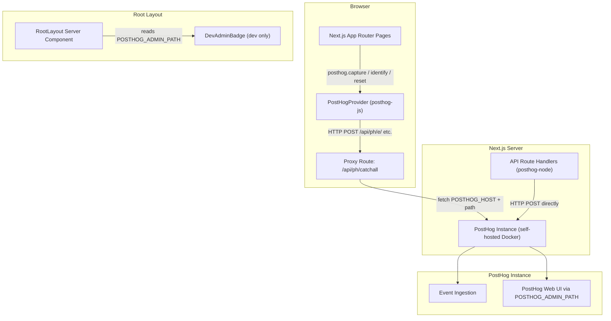

# Design Document: PostHog Analytics Integration

## Overview

This design integrates PostHog analytics into the Carnatic Artist Portal - a Next.js 14 App Router application with three route groups (`/(public)/*`, `/(artist)/*`, `/(admin)/*`). The integration is split across two SDK layers:

- **Client-side** (`posthog-js`): initialised once in the root layout via a React Provider, captures page views on every App Router navigation, and fires explicit events for user interactions.
- **Server-side** (`posthog-node`): used inside Next.js API route handlers to capture backend events (login, logout, registration approvals/rejections, artist suspension) with the actor's `artistId` as the PostHog `distinctId`.

All SDK traffic is routed through a Next.js reverse-proxy route (`/api/ph/[...path]`) so that the real PostHog host is never exposed to browsers and ad-blockers cannot target a known PostHog domain. The PostHog web UI is accessible only via a secret, non-guessable path stored in `POSTHOG_ADMIN_PATH`.

Privacy is a first-class concern: no PII is ever included in event properties, autocapture is disabled, and the client respects Do Not Track / opt-out cookies.

### Key Design Decisions

| Decision | Rationale |
|---|---|
| Proxy route instead of direct PostHog host | Prevents ad-blocker blocking; hides infrastructure topology |
| `capture_pageview: false` + manual capture | App Router uses client-side navigation; automatic pageview detection is unreliable |
| `posthog-node` singleton via module-level variable | Avoids re-initialising the Node SDK on every request in serverless/edge environments |
| `artistId` as `distinctId` (not email) | Avoids PII in PostHog person records; `artistId` is an opaque UUID |
| `mask_all_text: true` | Prevents accidental capture of visible text (names, emails shown in UI) |
| Dev-only floating badge (server-rendered) | Zero JS overhead; disappears automatically in production builds |

---

## Architecture



### Data Flow: Client-Side Event

1. User navigates or interacts with a page component.
2. The component calls `posthog.capture('event_name', { ...props })` via the `usePostHog()` hook.
3. `posthog-js` POSTs to `/api/ph/e/` (the proxy route).
4. The proxy route fetches `${POSTHOG_HOST}/e/` and streams the response back.
5. PostHog ingests the event.

### Data Flow: Server-Side Event

1. An API route handler (e.g. `/api/auth/login`) completes its business logic.
2. It calls `analyticsServer.capture({ distinctId: artistId, event: 'artist_login' })`.
3. `posthog-node` POSTs directly to `${POSTHOG_HOST}/capture/` (server-to-server, bypasses proxy).
4. PostHog ingests the event.

---

## Components and Interfaces

### 1. `lib/analytics-client.ts` - PostHog JS singleton

```typescript
// Exports the configured posthog-js instance.
// Used by PostHogProvider and usePostHog() hook consumers.
export function initPostHog(): void
export { posthog } from 'posthog-js'
```

Responsibilities:
- Calls `posthog.init()` with the correct options (see Data Models section).
- Guards against missing `NEXT_PUBLIC_POSTHOG_KEY`.
- Sets `debug: true` when `NODE_ENV === 'development'`.

### 2. `components/posthog-provider.tsx` - React context wrapper

```typescript
'use client'
export function PostHogProvider({ children }: { children: React.ReactNode }): JSX.Element
```

Responsibilities:
- Calls `initPostHog()` inside a `useEffect` (runs once on mount, client-only).
- Wraps children in `posthog-js/react`'s `PHProvider` so all descendants can call `usePostHog()`.
- Mounts the `PageViewTracker` component.

### 3. `components/page-view-tracker.tsx` - App Router navigation listener

```typescript
'use client'
export function PageViewTracker(): null
```

Responsibilities:
- Uses `usePathname()` and `useSearchParams()` from `next/navigation`.
- Fires `posthog.capture('$pageview', { $current_url: pathname + search })` on every navigation change.
- Returns `null` (no rendered output).

### 4. `app/api/ph/[...path]/route.ts` - Proxy route

```typescript
export async function GET(request: NextRequest, { params }: { params: { path: string[] } }): Promise<Response>
export async function POST(request: NextRequest, { params }: { params: { path: string[] } }): Promise<Response>
// HEAD, OPTIONS, PUT, DELETE also forwarded
```

Responsibilities:
- Reconstructs the target URL as `${POSTHOG_HOST}/${params.path.join('/')}` plus original query string.
- Forwards method, headers, and body unchanged.
- Streams the PostHog response back (status, headers, body).
- Returns 503 if `POSTHOG_HOST` is absent.
- No authentication required.

### 5. `lib/analytics-server.ts` - PostHog Node singleton

```typescript
import { PostHog } from 'posthog-node'

// Module-level singleton - initialised once per Node.js process.
export const analyticsServer: PostHog | null
export function shutdownAnalytics(): Promise<void>
```

Responsibilities:
- Creates a `PostHog` instance with `host: process.env.POSTHOG_HOST`.
- Returns `null` (no-op) if `POSTHOG_HOST` or `NEXT_PUBLIC_POSTHOG_KEY` is absent.
- Exports `shutdownAnalytics()` which calls `posthog.shutdown()` - called from a process `SIGTERM`/`SIGINT` handler.

### 6. `components/dev-admin-badge.tsx` - Development floating badge

```typescript
// Server Component - no 'use client' directive.
export function DevAdminBadge(): JSX.Element | null
```

Responsibilities:
- Reads `process.env.POSTHOG_ADMIN_PATH` and `process.env.NODE_ENV` at render time (server-side).
- Returns `null` when `NODE_ENV !== 'development'`.
- Renders a fixed-position amber badge with a link to the admin path (or a "not set" message).

### 7. `app/(public)/privacy/page.tsx` - Privacy policy page

A standard Next.js Server Component page at `/privacy` within the `/(public)` route group. Contains the required disclosures about PostHog analytics usage, data retention, opt-out mechanism, and self-hosted status.

### 8. Event-capturing hooks / inline captures

Each page or component that needs to fire an event calls `usePostHog()` and invokes `posthog.capture()` directly. No separate abstraction layer is introduced - the PostHog API is the abstraction.

---

## Data Models

### PostHog Init Options

```typescript
posthog.init(process.env.NEXT_PUBLIC_POSTHOG_KEY!, {
  api_host: '/api/ph',           // All SDK traffic via proxy
  capture_pageview: false,       // Manual page view tracking
  autocapture: false,            // Explicit events only
  mask_all_text: true,           // Prevent accidental text capture
  disable_session_recording: false, // implementation: sessionRecordingDisabled() in lib/analytics-client.ts (opt-out via env)
  persistence: 'localStorage+cookie',
  debug: process.env.NODE_ENV === 'development',
})
```

### Person Properties (set on `posthog.identify()`)

```typescript
posthog.identify(artistId, {
  role: 'artist',       // 'artist' | 'admin'
  province: string,     // e.g. 'Noord-Holland'
  // NOT set: email, name, contactNumber
})
```

### Event Catalogue

| Event Name | Trigger | Properties | SDK |
|---|---|---|---|
| `$pageview` | Every route change | `$current_url` | Client |
| `artist_listing_viewed` | `/artists` page mount | - | Client |
| `artist_profile_viewed` | `/artists/[slug]` page mount | `artist_slug` | Client |
| `cta_join_clicked` | "Join as an Artist" click | - | Client |
| `registration_submitted` | Registration form submit | `speciality_count` | Client |
| `artist_login` | Session created in login API | - | Server |
| `artist_logout` | Session cleared in logout API | - | Server |
| `dashboard_viewed` | `/dashboard` page mount | - | Client |
| `profile_edit_started` | "Edit profile" click | - | Client |
| `profile_edit_saved` | Profile save success | - | Client |
| `collab_created` | New collab form submit | - | Client |
| `availability_updated` | Availability save success | `window_count` | Client |
| `artist_search_performed` | Search results rendered | `result_count` | Client |
| `admin_dashboard_viewed` | `/admin/dashboard` page mount | - | Client |
| `registration_approved` | Approve API handler | `registration_id` | Server |
| `registration_rejected` | Reject API handler | `registration_id` | Server |
| `artist_suspension_changed` | Suspension API handler | `artist_id`, `suspended` | Server |

### Environment Variables

| Variable | Scope | Purpose |
|---|---|---|
| `NEXT_PUBLIC_POSTHOG_KEY` | Client + Server | PostHog project API key (begins `phc_`) |
| `POSTHOG_HOST` | Server only | Full URL of self-hosted PostHog instance |
| `POSTHOG_ADMIN_PATH` | Server only | Secret path to PostHog web UI |
| `NEXT_PUBLIC_POSTHOG_ENABLE_RECORDING` | Client | Optional. Set `false`, `0`, or `off` to **disable** session replay (enabled by default when the project key is set). |

### Opt-Out Detection

The `PostHogProvider` checks for opt-out signals on mount:

```typescript
// Check Do Not Track
const dnt = navigator.doNotTrack === '1' || (window as any).doNotTrack === '1'
// Check opt-out cookie
const optOutCookie = document.cookie.includes('ph_opt_out=1')

if (dnt || optOutCookie) {
  posthog.opt_out_capturing()
}
```

---

## Correctness Properties

*A property is a characteristic or behavior that should hold true across all valid executions of a system - essentially, a formal statement about what the system should do. Properties serve as the bridge between human-readable specifications and machine-verifiable correctness guarantees.*

The project already uses `fast-check` (present in `devDependencies`) and `vitest`. All property tests use `fc.assert(fc.property(...))` with the default 100 iterations minimum.

### Property 1: Page view capture includes current URL

*For any* URL pathname (including pathnames from all three route groups), when a route change occurs, `posthog.capture('$pageview')` is called with a `$current_url` property equal to that pathname.

**Validates: Requirements 2.1, 2.3**

### Property 2: No PII in any captured event

*For any* event captured by the Analytics_Client (page views, public visitor events, artist events, admin events), the event properties object must not contain any key whose name matches the set `{ 'email', 'name', 'fullName', 'contactNumber', 'phone' }`.

**Validates: Requirements 2.4, 3.5**

### Property 3: Artist profile event carries the correct slug

*For any* artist slug string, when the artist profile page is rendered for that slug, `posthog.capture('artist_profile_viewed')` is called with `{ artist_slug: slug }` where `slug` exactly matches the input.

**Validates: Requirements 3.2**

### Property 4: Registration event carries the correct speciality count

*For any* non-negative integer `n` representing the number of specialities selected, when the registration form is submitted with `n` specialities, `posthog.capture('registration_submitted')` is called with `{ speciality_count: n }`.

**Validates: Requirements 3.4**

### Property 5: Identify call uses artistId and non-PII properties only

*For any* `artistId` string and `province` string, when `posthog.identify()` is called after authentication, the call receives `artistId` as the first argument and a properties object that contains `role` and `province` but does not contain `email`, `name`, `fullName`, or `contactNumber`.

**Validates: Requirements 4.1, 4.2**

### Property 6: Server-side auth events use artistId as distinctId

*For any* `artistId` string, when the login API handler creates a session and when the logout API handler clears a session, `analyticsServer.capture()` is called with `distinctId` equal to that `artistId` and `event` equal to `'artist_login'` or `'artist_logout'` respectively.

**Validates: Requirements 4.4, 4.5**

### Property 7: Admin registration events carry the correct registration_id

*For any* `registrationId` string, when the approve or reject API handler processes that registration, `analyticsServer.capture()` is called with `properties.registration_id` equal to that `registrationId`.

**Validates: Requirements 6.1, 6.2**

### Property 8: Suspension event reflects input values

*For any* `artistId` string and `suspended` boolean, when the suspension API handler is called with those values, `analyticsServer.capture()` is called with `event: 'artist_suspension_changed'`, `properties.artist_id` equal to `artistId`, and `properties.suspended` equal to `suspended`.

**Validates: Requirements 6.3**

### Property 9: Proxy round-trip fidelity

*For any* request path suffix, HTTP method, request body, and mocked PostHog response (status code, response body), the proxy route forwards the request to `${POSTHOG_HOST}/${path}` with the original method and body, and returns a response with the same status code and body as the mocked PostHog response.

**Validates: Requirements 7.1, 7.2, 7.3**

### Property 10: Opt-out prevents event capture

*For any* combination of opt-out signals (Do Not Track header set, opt-out cookie present), when the `PostHogProvider` mounts with those signals active, `posthog.opt_out_capturing()` is called and no subsequent `posthog.capture()` calls are made.

**Validates: Requirements 9.3**

### Property 11: Availability event carries the correct window count

*For any* non-negative integer `n` representing the number of availability windows after an update, `posthog.capture('availability_updated')` is called with `{ window_count: n }`.

**Validates: Requirements 5.5**

### Property 12: Search event carries the correct result count

*For any* non-negative integer `n` representing the number of search results returned, `posthog.capture('artist_search_performed')` is called with `{ result_count: n }`.

**Validates: Requirements 5.6**

---

## Error Handling

### Missing `NEXT_PUBLIC_POSTHOG_KEY`

- `initPostHog()` checks for the key before calling `posthog.init()`.
- If absent or empty: logs `console.warn('[analytics] NEXT_PUBLIC_POSTHOG_KEY is not set - analytics disabled')` and returns without initialising.
- All subsequent `posthog.capture()` calls are no-ops because `posthog-js` is not initialised.

### Missing `POSTHOG_HOST`

- The proxy route (`/api/ph/[...path]`) returns `HTTP 503` with body `{ "error": "analytics unavailable" }`.
- `lib/analytics-server.ts` returns `null` for the singleton; all call sites guard with `analyticsServer?.capture(...)`.

### Proxy fetch failure (PostHog instance unreachable)

- The proxy route wraps the upstream `fetch()` in a try/catch.
- On network error: returns `HTTP 502` with body `{ "error": "upstream unreachable" }`.
- This is a best-effort degradation - analytics failure must never break the user-facing request.

### Server-side SDK shutdown

- `shutdownAnalytics()` calls `posthog.shutdown()` which flushes the event queue.
- Called from `process.on('SIGTERM', ...)` and `process.on('SIGINT', ...)` registered in `lib/analytics-server.ts` at module load time.
- The 5-second flush window is the `posthog-node` default; no custom timeout is needed.

### Analytics errors must not propagate

All `analyticsServer.capture()` calls in API route handlers are wrapped in a try/catch or use optional chaining. An analytics failure must never cause the API route to return an error response to the client.

```typescript
// Pattern used in all API route handlers:
try {
  analyticsServer?.capture({ distinctId: artistId, event: 'artist_login' })
} catch {
  // Silently ignore analytics errors
}
```

---

## Testing Strategy

### Dual Testing Approach

Unit tests cover specific examples, edge cases, and error conditions. Property-based tests (using `fast-check`) verify universal properties across many generated inputs. Both are run via `vitest`.

### Property-Based Tests

Each property from the Correctness Properties section is implemented as a single `fast-check` property test. Tests are tagged with a comment referencing the design property.

Configuration:
- Minimum 100 iterations per property (fast-check default).
- `posthog-js` and `posthog-node` are mocked via `vi.mock()` so tests are pure and fast.
- Tag format: `// Feature: posthog-analytics, Property N: <property_text>`

Property test file locations:
- `lib/__tests__/analytics-client.test.ts` - Properties 1, 2, 3, 4, 5, 10, 11, 12
- `lib/__tests__/analytics-server.test.ts` - Properties 6, 7, 8
- `app/api/ph/__tests__/proxy.test.ts` - Property 9

### Unit Tests

Unit tests cover:
- `PostHogProvider` renders without error and calls `posthog.init()` once with correct options (Requirements 1.1, 1.2, 1.5, 9.1, 9.2, 9.4, 10.4).
- Missing API key skips init and logs warning (Requirement 1.4).
- `DevAdminBadge` renders in development with a valid path, renders "not set" message when path is absent, and renders nothing in production (Requirements 11.1–11.5).
- Proxy route returns 503 when `POSTHOG_HOST` is absent (Requirement 7.4).
- Privacy policy page renders and contains required disclosure text (Requirement 12).
- Specific event captures for dashboard, profile edit, collab creation, admin dashboard (Requirements 5.1–5.4, 6.4).

### Integration Tests (manual / deployment)

The following requirements are verified manually or via deployment checks:
- PostHog instance not bound to public port (Requirement 8.1).
- Reverse-proxy rewrite maps `POSTHOG_ADMIN_PATH` to PostHog internal address (Requirement 8.2–8.5).
- `POSTHOG_ADMIN_PATH` not committed to version control (Requirement 8.6).
- `env.example` documents all three PostHog variables (Requirement 10.5).
- `.gitignore` includes `.env.local` and `.env` (Requirement 10.6).

### Test File Structure

```
lib/__tests__/
  analytics-client.test.ts    # PBT + unit tests for client-side analytics
  analytics-server.test.ts    # PBT + unit tests for server-side analytics
app/api/ph/
  [...path]/
    route.ts
  __tests__/
    proxy.test.ts             # PBT + unit tests for proxy route
components/__tests__/
  dev-admin-badge.test.tsx    # Unit tests for DevAdminBadge
  posthog-provider.test.tsx   # Unit tests for PostHogProvider init options
app/(public)/privacy/
  page.tsx
  __tests__/
    privacy-page.test.tsx     # Unit tests for privacy policy content
```
